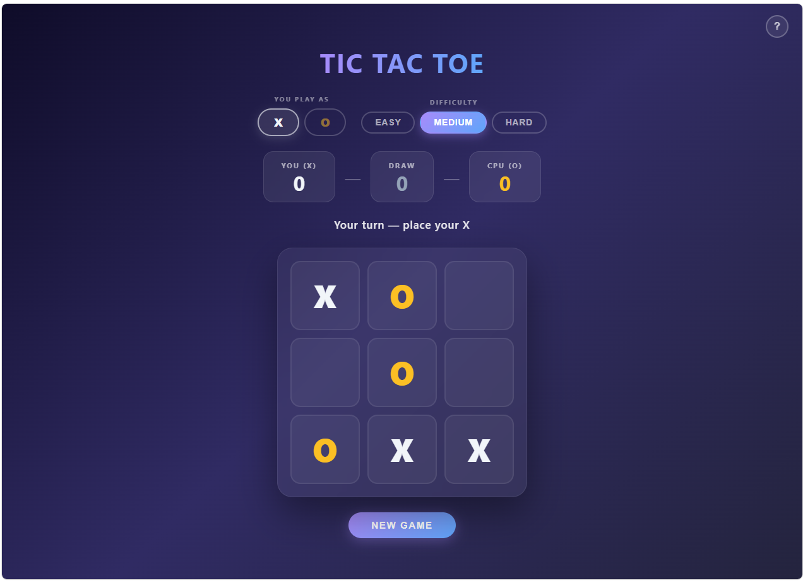

# Tic Tac Toe

[](LICENSE)

A single-file browser-based Tic Tac Toe game with a computer opponent. No dependencies, no build step — open `index.html` in any modern browser to play.



---

## How to Play

1. **Choose your symbol** — click **X** or **O** at the top. If you pick O, the computer moves first (X always goes first in standard rules).
2. **Choose a difficulty** — Easy, Medium, or Hard.
3. **Click any empty cell** to place your mark.
4. First to get three in a row (horizontally, vertically, or diagonally) wins. If all nine cells fill with no winner, the game is a draw.
5. Results appear in an overlay. Click **Play Again** to start a new round with the same settings, or **Change Settings** to adjust difficulty or symbol.
6. The **New Game** button below the board also resets immediately at any time.

### Scoring

The scoreboard tracks wins, losses, and draws across rounds. Scores reset when you switch your symbol or difficulty.

---

## Architecture

The entire application is one HTML file (`index.html`) with three sections:

```
index.html
├── <style>   — all CSS (layout, animations, theming)
├── <body>    — static HTML shell (controls, board container, result overlay)
└── <script>  — all game state and logic (vanilla JavaScript, no libraries)
```

There is no server, no framework, and no external assets.

### HTML Structure

```
.container
├── h1                        — title
├── .controls
│   ├── .control-group        — symbol picker (X / O buttons)
│   └── .control-group        — difficulty picker (Easy / Medium / Hard)
├── .scoreboard               — You / Draw / CPU score cards
├── .status                   — one-line game status message
├── #board                    — 3×3 grid of .cell divs (built by JS)
└── .btn#resetBtn             — New Game button

#resultOverlay                — full-screen modal shown at game end
└── .result-card
    ├── emoji, title, subtitle
    └── Play Again / Change Settings buttons
```

### CSS Design

- **Theme** — dark purple-to-navy gradient background; frosted-glass panels via `backdrop-filter: blur`.
- **Mark colors** — X is white (`#f1f5f9`), O is gold (`#fbbf24`).
- **Animations** — marks pop in with a spring-easing scale+rotate keyframe; winning cells pulse; the result card scales in from 0.8.
- **Hover preview** — a faint ghost of your symbol appears inside an empty cell on hover, coloured to match your mark.
- **Responsive** — cells and font shrink below 420 px viewport width.

---

## Game Logic

### State Variables

| Variable | Type | Purpose |
|---|---|---|
| `playerMark` | `'X'` \| `'O'` | The symbol the human plays |
| `cpuMark` | `'X'` \| `'O'` | The symbol the computer plays (always the opposite) |
| `board` | `Array(9)` | Flat array representing the 3×3 grid; `null` = empty |
| `gameOver` | `boolean` | Prevents moves after the game ends |
| `locked` | `boolean` | Blocks player clicks while the CPU is "thinking" |
| `difficulty` | `string` | `'easy'` \| `'medium'` \| `'hard'` |
| `scores` | `object` | `{ player, draws, cpu }` — persists across rounds |

### Win Detection — `checkWinner(board)`

The eight possible winning lines are stored as index triples:

```
Rows:       [0,1,2]  [3,4,5]  [6,7,8]
Columns:    [0,3,6]  [1,4,7]  [2,5,8]
Diagonals:  [0,4,8]  [2,4,6]
```

The function iterates all eight lines. If all three cells in a line hold the same non-null value, that value is the winner. If all nine cells are filled with no winner, it returns `'draw'`. Otherwise it returns `null` (game still in progress).

### Turn Flow

```
Player clicks cell
  └─► board[idx] = playerMark
  └─► checkWinner()
        ├── result found → endGame()
        └── no result   → triggerCPU()
                            └─► locked = true  (blocks board)
                            └─► setTimeout(380–600 ms)  ← simulated thinking delay
                                  └─► getMove() → board[move] = cpuMark
                                  └─► checkWinner()
                                        ├── result found → endGame()
                                        └── no result   → locked = false, player's turn
```

The artificial delay makes the CPU feel responsive rather than instant.

### AI — `getMove(board, difficulty)`

#### Easy
- 20% of the time plays the optimal move.
- 80% of the time picks a random empty cell.

#### Medium
- Always plays a **forced move** first (win immediately or block the player from winning).
- If no forced move exists, plays the optimal move 60% of the time and a random move 40% of the time.

#### Hard
- Always plays the **optimal move** via full minimax — it cannot be beaten, only drawn.

### Minimax with Alpha-Beta Pruning

`bestMove(board)` tries every empty cell as a CPU move, scores the resulting position with `minimax()`, and picks the cell with the highest score.

`minimax(board, depth, isMax, alpha, beta)` is a recursive search:

- **Base cases** — CPU wins → `+10 - depth` (faster wins score higher); Player wins → `depth - 10` (faster losses score lower); Draw → `0`.
- **Maximising node** (CPU's turn) — picks the child with the highest score; prunes when `alpha ≥ beta`.
- **Minimising node** (Player's turn) — picks the child with the lowest score; prunes when `beta ≤ alpha`.

Alpha-beta pruning eliminates branches that cannot affect the final decision, keeping Hard mode instantaneous despite the full 9! search space.

### Symbol Selection

When the user switches their symbol, `playerMark` and `cpuMark` swap. `resetGame()` checks: if `playerMark === 'O'`, it calls `triggerCPU()` immediately so the computer (X) takes the opening move.

---

## Running the Game

**WSL / Linux**
```bash
# Open directly in the default Windows browser (WSL)
explorer.exe index.html

# Or with wslu installed
wslview index.html
```

**macOS**
```bash
open index.html
```

**Windows**
```powershell
start index.html
```

**Any platform — local HTTP server**
```bash
python3 -m http.server 8080
# then open http://localhost:8080 in your browser
```

---

*Vibe coded with [Claude](https://claude.ai) by Anthropic.*
